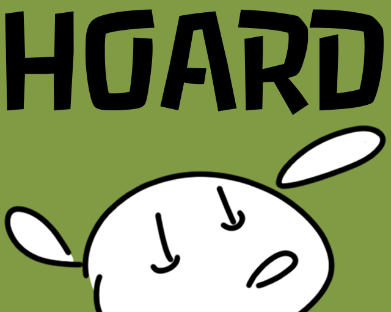

# Hoard

Play [in your browser](http://gelisam.com/ludum-dare-42/)!

This is [our entry for Ludum Dare edition #42](https://ldjam.com/events/ludum-dare/42/Hoard), a competition where you have 72 hours to program a game from scratch. The theme for this edition was "Running out of Space".
